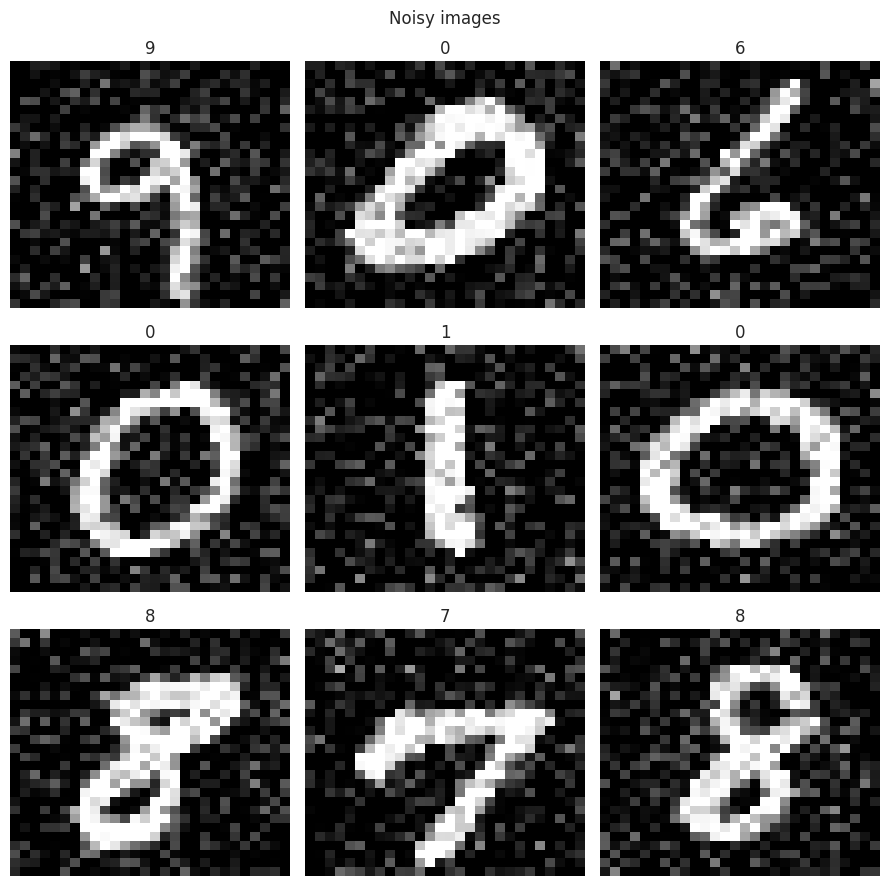
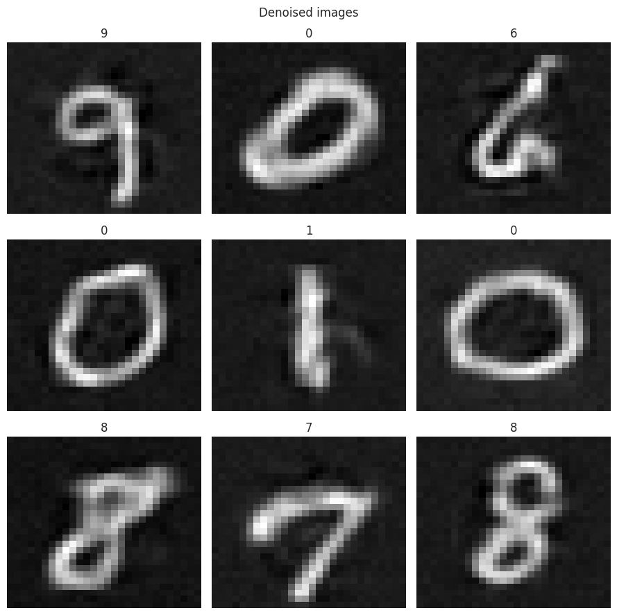

# Image denoising using autoencoder

This project aims to use autoencoder neural network to reduce noise in images.

## Data

Data used for purpose described above is classical MNIST handwritten digits dataset.
It is corrupted by adding gaussian noise $\mathcal{N}\left(\mu=0, \,\sigma=0.2\right)$.

## Results

|   |
|---|
|   |
||

## Requirements

Needed libraries are gathered in `requirements.txt`.
