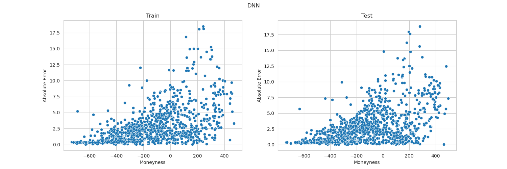

# European call option pricing using DNN

This project aims to use a Deep Neural Network (DNN) to price European Call options. The DNN model is trained on option pricing data generated using Black-Scholes formula.

## Data

Data is generated for specific values of underlying, strike, interest rate, volatility and time to maturity (all modelled as uniform distrubution).

Check out `create_data.py` and `prepare_data.py` from `scripts` and `EDA.ipynb` from `notebooks` to find out more.

## Models and results

DNN and Random Forest models were hypertuned and saved to `models` directory. 
The details of training are described in notebooks.

Final results:
* DNN test RMSE: $4.15478$,
* RandomForest test RMSE: $6.99514$.

| |
|---|
| |
||

## Set up

Clone the repository and run `make setup` to prepare Python environment.

You can do it on your own using `requiremenets.txt`.

You can train the neural network by specyfing params in `train.py` and running `make train`.