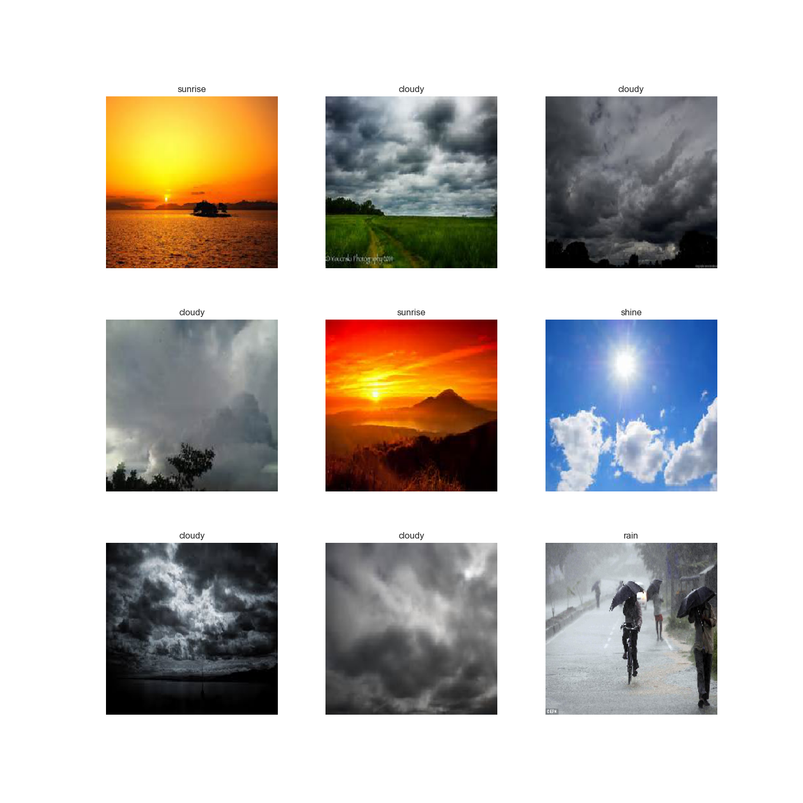
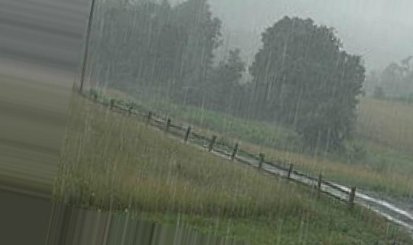
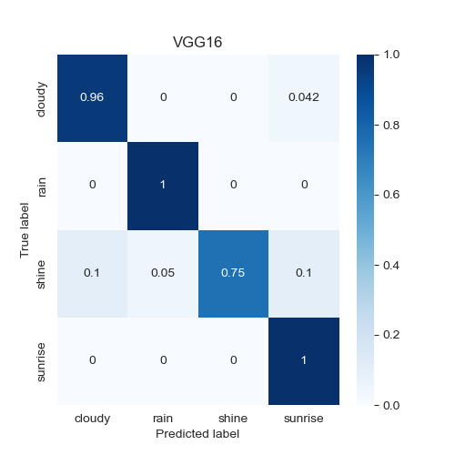
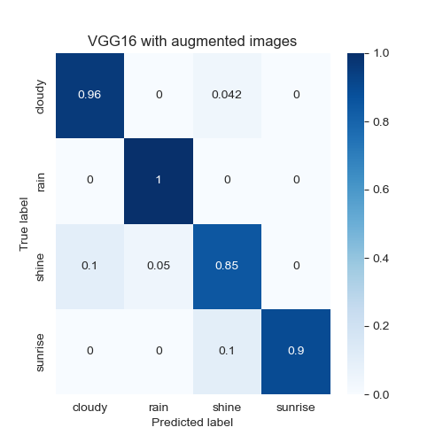
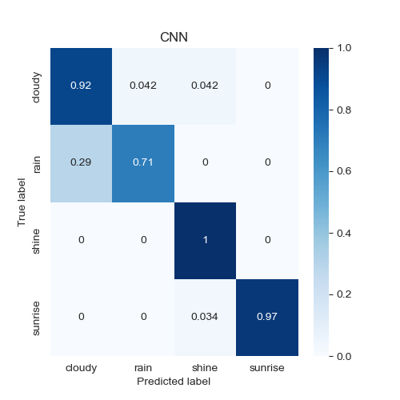
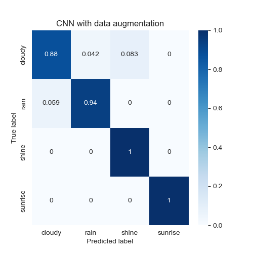

# Weather images classification

This project is aimed to classify type of weather depicted in image.

To achieve this goal, two models were trained: custom CNN network and VGG16 network with weights pretrained on ImageNet dataset. 

Both models were then also trained using augemented data (rotation, zoom, shift, flip). 

## Data

There are four classes in dataset: cloudy, rain, shine and sunrise.

Dataset details: Ajayi, Gbeminiyi (2018), “Multi-class Weather Dataset for Image Classification”, Mendeley Data, V1, doi: 10.17632/4drtyfjtfy.1

Exemplary images:
||
|---|
||

Augmented images are stored in `augmented` folder.

Exemplary augmented images:
|   |   |   |   |
|---|---|---|---|
|||||

### Results

| Model | Accuracy | Confusion matrix |
| --- | --- | --- |
| VGG16 | 0.93 |  |
| VGG16 with augmented images | 0.92 |  |
| CNN | 0.91 |  |
| CNN with augmented images | 0.96 |  |

### How to run

Install required packages using `pip install -r requirements.txt`.
